**中文** | [English](./README.en.md)

# Inflex for Fcitx5

[](https://github.com/sanweiya/fcitx5-inflex-themes/stargazers) [](https://github.com/sanweiya/fcitx5-inflex-themes/stargazers) [](https://github.com/sanweiya/fcitx5-inflex-themes/stargazers) [](https://github.com/sanweiya/fcitx5-inflex-themes/stargazers) [](https://github.com/sanweiya/fcitx5-inflex-themes/stargazers)

Aesthetic, modern fcitx5 theme featuring sharp-edged rectangle design.

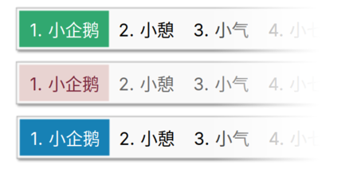

> Rounded rectangle enthusiasts? Why not check out [fcitx5-mellow-themes](https://github.com/sanweiya/fcitx5-mellow-themes)

## What's New

- A semi-transparent, blurred input window for KWin

  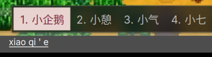

## Usage

### Manual Installation (for the current user)

```
git clone https://github.com/sanweiya/fcitx5-inflex-themes.git
```

```
cd fcitx5-inflex-themes/
```

Solid version:

```
mkdir -p ~/.local/share/fcitx5/themes && cp -r ./inflex-* ~/.local/share/fcitx5/themes
```

Semi-transparent, blurred version: 

```
mkdir -p ~/.local/share/fcitx5/themes && cp -r ./kwinblur-inflex-* ~/.local/share/fcitx5/themes
```

## Screenshots

- **Youlan 釉蓝**
  
  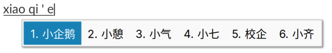 [youlan-dark](./preview/youlan-dark.png) 
  
- **Sakura 灰樱**
  
  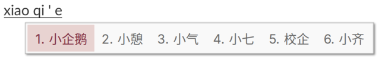 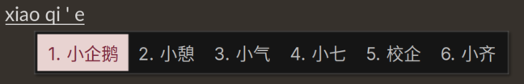
  
- **Vermilion 朱砂**
  
  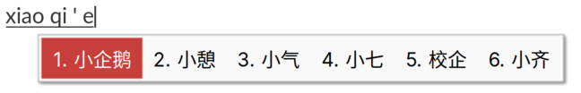 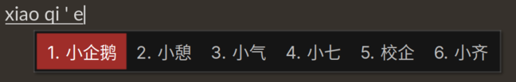
  
- **Wechat 微言**
  
  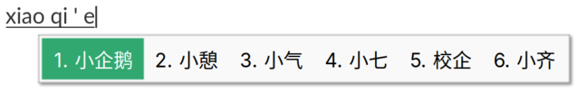 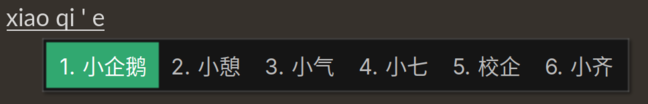
  
- **Graphite 石墨**
  
  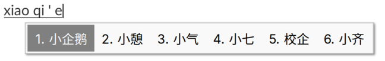 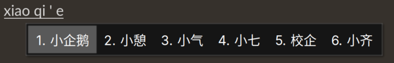
  
- **Vertical & Dual-line**
  
  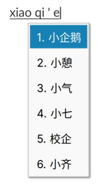 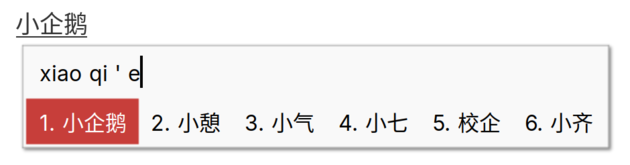

## EOF
