**中文** | [English](./README.en.md)

# Inflex for Fcitx5

[](https://github.com/sanweiya/fcitx5-inflex-themes/stargazers) [](https://github.com/sanweiya/fcitx5-inflex-themes/stargazers) [](https://github.com/sanweiya/fcitx5-inflex-themes/stargazers) [](https://github.com/sanweiya/fcitx5-inflex-themes/stargazers) [](https://github.com/sanweiya/fcitx5-inflex-themes/stargazers)

美观、现代的 fcitx5 主题，采用直角设计。

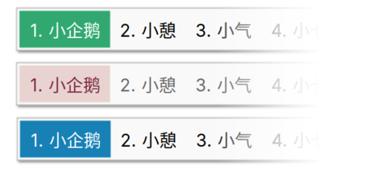

> 圆角矩形爱好者？不妨看看 [fcitx5-mellow-themes](https://github.com/sanweiya/fcitx5-mellow-themes)

## ⚠️~~KWin下的半透明模糊~~

- ~~适用于 KWin 的输入法窗口半透明模糊~~

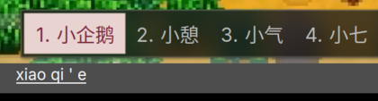

由于懒得修复，不再发布该变体主题。

## 使用方法

### 手动安装 (为当前用户) 

```
git clone https://github.com/sanweiya/fcitx5-inflex-themes.git
```

```
cd fcitx5-inflex-themes/
```

```
mkdir -p ~/.local/share/fcitx5/themes && cp -r ./inflex-* ~/.local/share/fcitx5/themes
```

当然，也可以自己选择需要复制的部分。

## Screenshots

- **Youlan 釉蓝**
  
  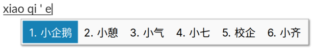 [youlan-dark](./preview/youlan-dark.png) 
  
- **Sakura 灰樱**
  
  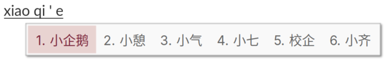 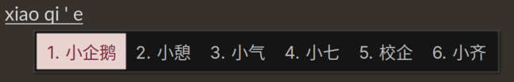
  
- **Vermilion 朱砂**
  
  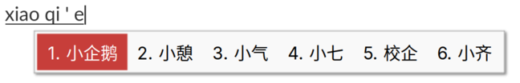 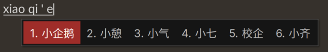
  
- **Wechat 微言**
  
  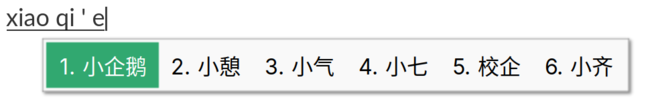 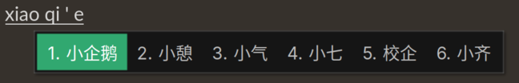
  
- **Graphite 石墨**
  
  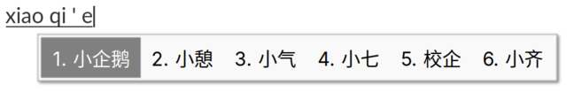 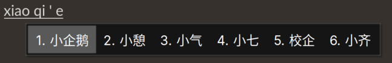
  
- **Vertical & Dual-line**
  
  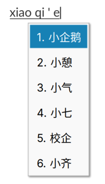 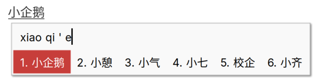

## EOF
